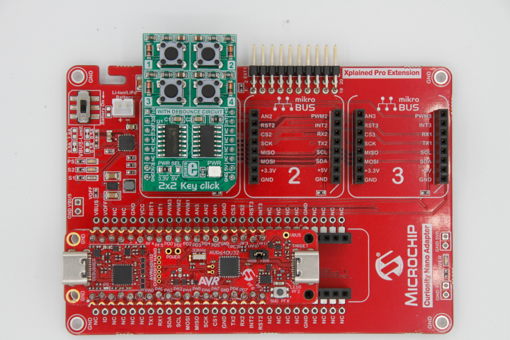

<!-- Please do not change this logo with link -->

# USB Keypad with AVR64DU32 

This example shows how to use the USB Stack Library inside of MPLAB&reg; Code Configurator (MCC) to implement a simple USB Keypad. The AVR64DU32 family of microcontrollers contain a configurable Full Speed (FS) USB 2.0 transceiver.  

## Related Documentation

- [AVR64DU32 Product Page](https://www.microchip.com/en-us/product/AVR64DU32?utm_source=GitHub&utm_medium=TextLink&utm_campaign=MCU8_AVR-DU&utm_content=avr64du32-keypad-mplab-mcc-github&utm_bu=MCU08)

### USB Specifications

- [USB Human Interface Device (HID) Specification](https://www.usb.org/document-library/device-class-definition-hid-111)
- [Device Class Definition for HID 1.11](https://usb.org/document-library/hid-usage-tables-15)
- [USB 2.0 Specification](https://www.usb.org/document-library/usb-20-specification)

## Software Used

- [MPLAB X IDE 6.20.0 or newer](https://www.microchip.com/en-us/tools-resources/develop/mplab-x-ide?utm_source=GitHub&utm_medium=TextLink&utm_campaign=MCU8_AVR-DU&utm_content=avr64du32-keypad-mplab-mcc-github&utm_bu=MCU08)
- [MPLAB XC8 2.46.0 or newer](https://www.microchip.com/en-us/tools-resources/develop/mplab-xc-compilers?utm_source=GitHub&utm_medium=TextLink&utm_campaign=MCU8_AVR-DU&utm_content=avr64du32-keypad-mplab-mcc-github&utm_bu=MCU08)
- [MPLAB Code Configurator (MCC)](https://www.microchip.com/en-us/tools-resources/configure/mplab-code-configurator?utm_source=GitHub&utm_medium=TextLink&utm_campaign=MCU8_AVR-DU&utm_content=avr64du32-keypad-mplab-mcc-github&utm_bu=MCU08) 
- AVR-Dx_DFP v2.4.286

## Hardware Used

- [AVR64DU32 Curiosity Nano (EV59F82A)](https://www.microchip.com/en-us/development-tool/EV59F82A?utm_source=GitHub&utm_medium=TextLink&utm_campaign=MCU8_AVR-DU&utm_content=avr64du32-keypad-mplab-mcc-github&utm_bu=MCU08)
- [Curiosity Nano Base for Clicks&trade; (AC164162)](https://www.microchip.com/en-us/development-tool/AC164162?utm_source=GitHub&utm_medium=TextLink&utm_campaign=MCU8_AVR-DU&utm_content=avr64du32-keypad-mplab-mcc-github&utm_bu=MCU08)
- [2x2 Click (MIKROE-2152)](https://www.mikroe.com/2x2-key-click)

## Setup

With the power off, plug in the 2x2 Click into Slot 1. Place the AVR64DU32 Curiosity Nano into the slot, with the programmer USB on the left edge, as shown in the image below.  

  

### UART Settings (Debug)

- Baud Rate: 9600
- Char Length: 8-bits
- Parity: None
- Stop Bits: 1 bit

### I/O Usage

| Pin | Function 
| --- | -------
| PA7 | Button 3
| PC3 | VBUS Detect
| PD2 | Button 4
| PD5 | Button 1
| PD6 | UART TX
| PD7 | UART RX (Reserved)
| PF2 | LED0 (on Curiosity Nano)
| PF4 | Button 2
| PF5 | Interrupt (Reserved)
| PF6 | SW0 (on Curiosity Nano)

**Note**: Reserved pins are physically in use, but not used in the actual application.  

### USB Configuration  

Class: Human Interface Device (HID)  
Protocol: Keyboard  
Endpoints: CONTROL and IN  

## Theory of Operation

### USB Detection

On Power-on-Reset (POR), the system initializes the peripherals and sets the application state to `APPLICATION_USB_NOT_INIT`. The program polls the Analog Comparator (AC) and monitors the voltage on VBUS through a voltage divider on the Curiosity Nano. When VBUS is detected, the USB initialization sequence is triggered.  

### USB Initialization

Once VBUS is detected, the Nano can start the USB transceiver by calling the function `USB_Start`. If it is successful, the application transitions into the `APPLICATION_USB_INIT` state. If this fails `USB_INIT_RETRIES` times, the application moves to the `APPLICATION_USB_ERROR` state and remains there until the cable is unplugged.  

### USB Polling and Management

In the `APPLICATION_USB_INIT` state, events from the USB host are handled by calling the function `USBDevice_Handle`. If data is to be sent from the MCU to the Host, the function `USB_HIDKeyboardReportInSend` is used to queue a data report.  

### Key Handling

A simple state machine is called every 5 ms to handle key presses in this application. The 5 ms delay is used to debounce the SW0 input. 

- On POR, the state machine starts in the `NOT_PRESSED` state. Every 5 ms, the buttons are polled to see if they are pressed. If a button is pressed, key down event(s) are loaded into a report and queued for send. The key press state machine advances to the `PRESSED` state. 

- In the `PRESSED` state, the application clears the key down events and queues the now empty report for send. This is required, as the computer will assume the button is pressed until told otherwise. The state machine advances to the `HELD_WAIT` state after queueing the data. 

- The application waits in `HELD_WAIT` state until all of the keys are released. Once the keys are all released, the state machine returns to the `NOT_PRESSED` state.

## Operation

The buttons of the 2x2 Click perform the following actions:

| Button | Keys | Function
| ------ | ----- | --------
| 1 | CTRL + C | Copy
| 2 | CTRL + V | Paste
| 3 | CTRL + Z | Undo
| 4 | CTRL + X | Cut
| SW0 | "AVR DU" | Prints the string "AVR DU"

**Note 1**: SW0 is located on the Curiosity Nano.

**Note 2**: The 2x2 Click debouncing causes the buttons to be held for an extra ~0.5s. The code is designed with a one-shot to prevent this from causing issues, however quickly switching buttons or tapping is not possible.

## Summary
This example has shown the AVR64DU32 family of MCUs as a USB Keypad.  